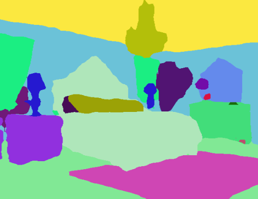
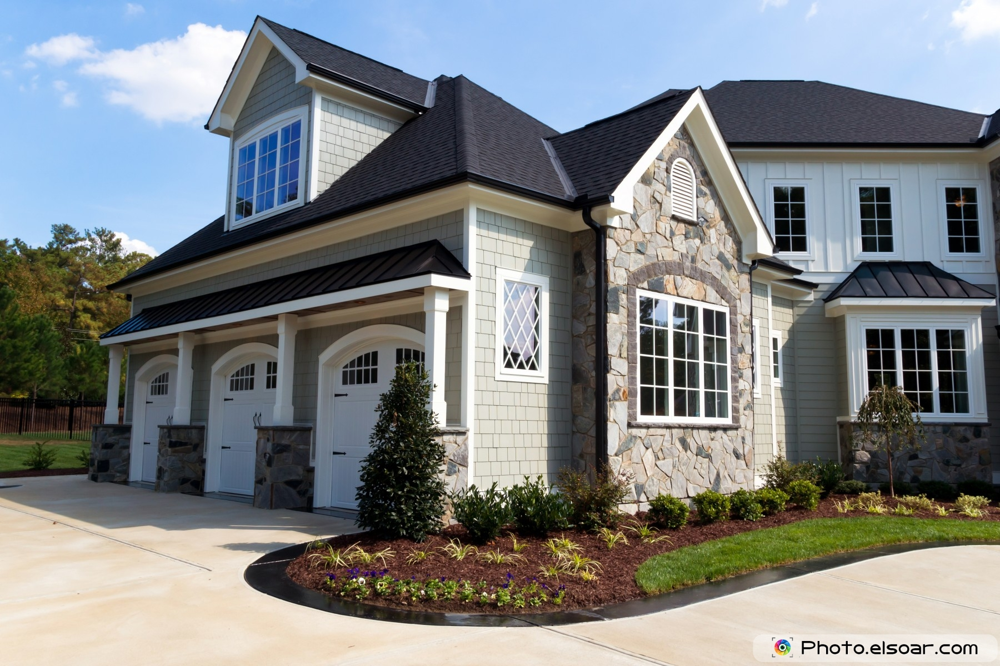
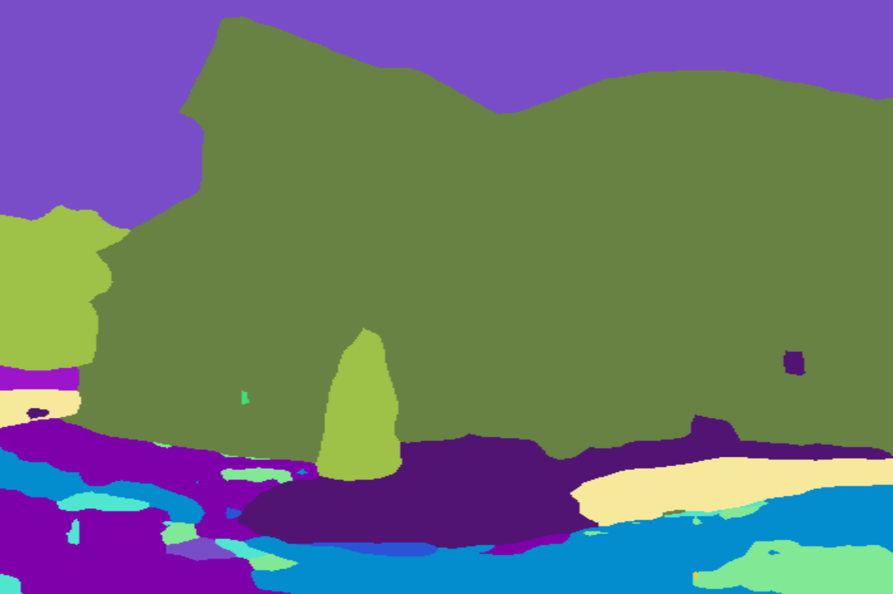

# Image Segmentation Keras : Implementation of Segnet, FCN, UNet, PSPNet and other models in Keras.

[](https://badge.fury.io/py/keras-segmentation)
[](https://pepy.tech/project/keras-segmentation)
[](https://travis-ci.org/divamgupta/image-segmentation-keras)
[](http://perso.crans.org/besson/LICENSE.html)
[](https://twitter.com/divamgupta)


Implementation of various Deep Image Segmentation models in keras.

Link to the full blog post with tutorial : https://divamgupta.com/image-segmentation/2019/06/06/deep-learning-semantic-segmentation-keras.html

<p align="center">
  
</p>

## Working Google Colab Examples:
* Python Interface: https://colab.research.google.com/drive/1q_eCYEzKxixpCKH1YDsLnsvgxl92ORcv?usp=sharing
* CLI Interface: https://colab.research.google.com/drive/1Kpy4QGFZ2ZHm69mPfkmLSUes8kj6Bjyi?usp=sharing


## Our Other Repositories
- [Attention based Language Translation in Keras](https://github.com/divamgupta/attention-translation-keras)
- [Ladder Network in Keras](https://github.com/divamgupta/ladder_network_keras)  model achives 98% test accuracy on MNIST with just 100 labeled examples

### Top Contributors

* [Divam Gupta](https://divamgupta.com) [](https://twitter.com/divamgupta)
* [Rounaq Jhunjhunu wala](https://github.com/rjalfa)
* [Marius Juston](https://github.com/Marius-Juston)
* [JaledMC](https://github.com/JaledMC)

## Models

Following models are supported:

| model_name       | Base Model        | Segmentation Model |
|------------------|-------------------|--------------------|
| fcn_8            | Vanilla CNN       | FCN8               |
| fcn_32           | Vanilla CNN       | FCN8               |
| fcn_8_vgg        | VGG 16            | FCN8               |
| fcn_32_vgg       | VGG 16            | FCN32              |
| fcn_8_resnet50   | Resnet-50         | FCN32              |
| fcn_32_resnet50  | Resnet-50         | FCN32              |
| fcn_8_mobilenet  | MobileNet         | FCN32              |
| fcn_32_mobilenet | MobileNet         | FCN32              |
| pspnet           | Vanilla CNN       | PSPNet             |
| vgg_pspnet       | VGG 16            | PSPNet             |
| resnet50_pspnet  | Resnet-50         | PSPNet             |
| unet_mini        | Vanilla Mini CNN  | U-Net              |
| unet             | Vanilla CNN       | U-Net              |
| vgg_unet         | VGG 16            | U-Net              |
| resnet50_unet    | Resnet-50         | U-Net              |
| mobilenet_unet   | MobileNet         | U-Net              |
| segnet           | Vanilla CNN       | Segnet             |
| vgg_segnet       | VGG 16            | Segnet             |
| resnet50_segnet  | Resnet-50         | Segnet             |
| mobilenet_segnet | MobileNet         | Segnet             |


Example results for the pre-trained models provided :

Input Image            |  Output Segmentation Image
:-------------------------:|:-------------------------:
  |  
  |  


## Getting Started

### Prerequisites

* Keras ( recommended version : 2.4.3 )
* OpenCV for Python
* Tensorflow ( recommended  version : 2.4.1 )

```shell
apt-get install -y libsm6 libxext6 libxrender-dev
pip install opencv-python
```

### Installing

Install the module

Recommended way:
```shell
pip install --upgrade git+https://github.com/divamgupta/image-segmentation-keras
```

### or 

```shell
pip install keras-segmentation
```

### or

```shell
git clone https://github.com/divamgupta/image-segmentation-keras
cd image-segmentation-keras
python setup.py install
```


## Pre-trained models:
```python
from keras_segmentation.pretrained import pspnet_50_ADE_20K , pspnet_101_cityscapes, pspnet_101_voc12

model = pspnet_50_ADE_20K() # load the pretrained model trained on ADE20k dataset

model = pspnet_101_cityscapes() # load the pretrained model trained on Cityscapes dataset

model = pspnet_101_voc12() # load the pretrained model trained on Pascal VOC 2012 dataset

# load any of the 3 pretrained models

out = model.predict_segmentation(
    inp="input_image.jpg",
    out_fname="out.png"
)

```


### Preparing the data for training

You need to make two folders

*  Images Folder - For all the training images
* Annotations Folder - For the corresponding ground truth segmentation images

The filenames of the annotation images should be same as the filenames of the RGB images.

The size of the annotation image for the corresponding RGB image should be same.

For each pixel in the RGB image, the class label of that pixel in the annotation image would be the value of the blue pixel.

Example code to generate annotation images :

```python
import cv2
import numpy as np

ann_img = np.zeros((30,30,3)).astype('uint8')
ann_img[ 3 , 4 ] = 1 # this would set the label of pixel 3,4 as 1

cv2.imwrite( "ann_1.png" ,ann_img )
```

Only use bmp or png format for the annotation images.

## Download the sample prepared dataset

Download and extract the following:

https://drive.google.com/file/d/0B0d9ZiqAgFkiOHR1NTJhWVJMNEU/view?usp=sharing

You will get a folder named dataset1/


## Using the python module

You can import keras_segmentation in  your python script and use the API

```python
from keras_segmentation.models.unet import vgg_unet

model = vgg_unet(n_classes=51 ,  input_height=416, input_width=608  )

model.train(
    train_images =  "dataset1/images_prepped_train/",
    train_annotations = "dataset1/annotations_prepped_train/",
    checkpoints_path = "/tmp/vgg_unet_1" , epochs=5
)

out = model.predict_segmentation(
    inp="dataset1/images_prepped_test/0016E5_07965.png",
    out_fname="/tmp/out.png"
)

import matplotlib.pyplot as plt
plt.imshow(out)

# evaluating the model 
print(model.evaluate_segmentation( inp_images_dir="dataset1/images_prepped_test/"  , annotations_dir="dataset1/annotations_prepped_test/" ) )

```


## Usage via command line
You can also use the tool just using command line

### Visualizing the prepared data

You can also visualize your prepared annotations for verification of the prepared data.


```shell
python -m keras_segmentation verify_dataset \
 --images_path="dataset1/images_prepped_train/" \
 --segs_path="dataset1/annotations_prepped_train/"  \
 --n_classes=50
```

```shell
python -m keras_segmentation visualize_dataset \
 --images_path="dataset1/images_prepped_train/" \
 --segs_path="dataset1/annotations_prepped_train/"  \
 --n_classes=50
```


### Training the Model

To train the model run the following command:

```shell
python -m keras_segmentation train \
 --checkpoints_path="path_to_checkpoints" \
 --train_images="dataset1/images_prepped_train/" \
 --train_annotations="dataset1/annotations_prepped_train/" \
 --val_images="dataset1/images_prepped_test/" \
 --val_annotations="dataset1/annotations_prepped_test/" \
 --n_classes=50 \
 --input_height=320 \
 --input_width=640 \
 --model_name="vgg_unet"
```

Choose model_name from the table above


### Getting the predictions

To get the predictions of a trained model

```shell
python -m keras_segmentation predict \
 --checkpoints_path="path_to_checkpoints" \
 --input_path="dataset1/images_prepped_test/" \
 --output_path="path_to_predictions"

```


### Video inference

To get predictions of a video
```shell
python -m keras_segmentation predict_video \
 --checkpoints_path="path_to_checkpoints" \
 --input="path_to_video" \
 --output_file="path_for_save_inferenced_video" \
 --display
```

If you want to make predictions on your webcam, don't use `--input`, or pass your device number: `--input 0`  
`--display` opens a window with the predicted video. Remove this argument when using a headless system.


### Model Evaluation 

To get the IoU scores 

```shell
python -m keras_segmentation evaluate_model \
 --checkpoints_path="path_to_checkpoints" \
 --images_path="dataset1/images_prepped_test/" \
 --segs_path="dataset1/annotations_prepped_test/"
```


## Fine-tuning from existing segmentation model

The following example shows how to fine-tune a model with 10 classes .

```python
from keras_segmentation.models.model_utils import transfer_weights
from keras_segmentation.pretrained import pspnet_50_ADE_20K
from keras_segmentation.models.pspnet import pspnet_50

pretrained_model = pspnet_50_ADE_20K()

new_model = pspnet_50( n_classes=51 )

transfer_weights( pretrained_model , new_model  ) # transfer weights from pre-trained model to your model

new_model.train(
    train_images =  "dataset1/images_prepped_train/",
    train_annotations = "dataset1/annotations_prepped_train/",
    checkpoints_path = "/tmp/vgg_unet_1" , epochs=5
)


```


## Knowledge distillation for compressing the model

The following example shows transfer the knowledge from a larger ( and more accurate ) model to a smaller model. In most cases the smaller model trained via knowledge distilation is more accurate compared to the same model trained using vanilla supervised learning. 

```python
from keras_segmentation.predict import model_from_checkpoint_path
from keras_segmentation.models.unet import unet_mini
from keras_segmentation.model_compression import perform_distilation

model_large = model_from_checkpoint_path( "/checkpoints/path/of/trained/model" )
model_small = unet_mini( n_classes=51, input_height=300, input_width=400  )

perform_distilation ( data_path="/path/to/large_image_set/" , checkpoints_path="path/to/save/checkpoints" , 
    teacher_model=model_large ,  student_model=model_small  , distilation_loss='kl' , feats_distilation_loss='pa' )

```


## Adding custom augmentation function to training

The following example shows how to define a custom augmentation function for training.

```python

from keras_segmentation.models.unet import vgg_unet
from imgaug import augmenters as iaa

def custom_augmentation():
    return  iaa.Sequential(
        [
            # apply the following augmenters to most images
            iaa.Fliplr(0.5),  # horizontally flip 50% of all images
            iaa.Flipud(0.5), # horizontally flip 50% of all images
        ])

model = vgg_unet(n_classes=51 ,  input_height=416, input_width=608)

model.train(
    train_images =  "dataset1/images_prepped_train/",
    train_annotations = "dataset1/annotations_prepped_train/",
    checkpoints_path = "/tmp/vgg_unet_1" , epochs=5, 
    do_augment=True, # enable augmentation 
    custom_augmentation=custom_augmentation # sets the augmention function to use
)
```
## Custom number of input channels

The following example shows how to set the number of input channels.

```python

from keras_segmentation.models.unet import vgg_unet

model = vgg_unet(n_classes=51 ,  input_height=416, input_width=608, 
                 channels=1 # Sets the number of input channels
                 )

model.train(
    train_images =  "dataset1/images_prepped_train/",
    train_annotations = "dataset1/annotations_prepped_train/",
    checkpoints_path = "/tmp/vgg_unet_1" , epochs=5, 
    read_image_type=0  # Sets how opencv will read the images
                       # cv2.IMREAD_COLOR = 1 (rgb),
                       # cv2.IMREAD_GRAYSCALE = 0,
                       # cv2.IMREAD_UNCHANGED = -1 (4 channels like RGBA)
)
```

## Custom preprocessing

The following example shows how to set a custom image preprocessing function.

```python

from keras_segmentation.models.unet import vgg_unet

def image_preprocessing(image):
    return image + 1

model = vgg_unet(n_classes=51 ,  input_height=416, input_width=608)

model.train(
    train_images =  "dataset1/images_prepped_train/",
    train_annotations = "dataset1/annotations_prepped_train/",
    checkpoints_path = "/tmp/vgg_unet_1" , epochs=5,
    preprocessing=image_preprocessing # Sets the preprocessing function
)
```

## Custom callbacks

The following example shows how to set custom callbacks for the model training.

```python

from keras_segmentation.models.unet import vgg_unet
from tensorflow.keras.callbacks import ModelCheckpoint, EarlyStopping

model = vgg_unet(n_classes=51 ,  input_height=416, input_width=608 )

# When using custom callbacks, the default checkpoint saver is removed
callbacks = [
    ModelCheckpoint(
                filepath="checkpoints/" + model.name + ".{epoch:05d}",
                save_weights_only=True,
                verbose=True
            ),
    EarlyStopping()
]

model.train(
    train_images =  "dataset1/images_prepped_train/",
    train_annotations = "dataset1/annotations_prepped_train/",
    checkpoints_path = "/tmp/vgg_unet_1" , epochs=5,
    callbacks=callbacks
)
```

## Multi input image input

The following example shows how to add additional image inputs for models.

```python

from keras_segmentation.models.unet import vgg_unet

model = vgg_unet(n_classes=51 ,  input_height=416, input_width=608)

model.train(
    train_images =  "dataset1/images_prepped_train/",
    train_annotations = "dataset1/annotations_prepped_train/",
    checkpoints_path = "/tmp/vgg_unet_1" , epochs=5,
    other_inputs_paths=[
        "/path/to/other/directory"
    ],
    
    
#     Ability to add preprocessing
    preprocessing=[lambda x: x+1, lambda x: x+2, lambda x: x+3], # Different prepocessing for each input
#     OR
    preprocessing=lambda x: x+1, # Same preprocessing for each input
)
```


## Projects using keras-segmentation
Here are a few projects which are using our library :
* https://github.com/SteliosTsop/QF-image-segmentation-keras [paper](https://arxiv.org/pdf/1908.02242.pdf)
* https://github.com/willembressers/bouquet_quality
* https://github.com/jqueguiner/image-segmentation
* https://github.com/pan0rama/CS230-Microcrystal-Facet-Segmentation
* https://github.com/theerawatramchuen/Keras_Segmentation
* https://github.com/neheller/labels18
* https://github.com/Divyam10/Face-Matting-using-Unet
* https://github.com/shsh-a/segmentation-over-web
* https://github.com/chenwe73/deep_active_learning_segmentation
* https://github.com/vigneshrajap/vision-based-navigation-agri-fields
* https://github.com/ronalddas/Pneumonia-Detection
* https://github.com/Aiwiscal/ECG_UNet
* https://github.com/TianzhongSong/Unet-for-Person-Segmentation
* https://github.com/Guyanqi/GMDNN
* https://github.com/kozemzak/prostate-lesion-segmentation
* https://github.com/lixiaoyu12138/fcn-date
* https://github.com/sagarbhokre/LyftChallenge
* https://github.com/TianzhongSong/Person-Segmentation-Keras
* https://github.com/divyanshpuri02/COCO_2018-Stuff-Segmentation-Challenge
* https://github.com/XiangbingJi/Stanford-cs230-final-project
* https://github.com/lsh1994/keras-segmentation
* https://github.com/SpirinEgor/mobile_semantic_segmentation
* https://github.com/LeadingIndiaAI/COCO-DATASET-STUFF-SEGMENTATION-CHALLENGE
* https://github.com/lidongyue12138/Image-Segmentation-by-Keras
* https://github.com/laoj2/segnet_crfasrnn
* https://github.com/rancheng/AirSimProjects
* https://github.com/RadiumScriptTang/cartoon_segmentation
* https://github.com/dquail/NerveSegmentation
* https://github.com/Bhomik/SemanticHumanMatting
* https://github.com/Symefa/FP-Biomedik-Breast-Cancer
* https://github.com/Alpha-Monocerotis/PDF_FigureTable_Extraction
* https://github.com/rusito-23/mobile_unet_segmentation
* https://github.com/Philliec459/ThinSection-image-segmentation-keras

If you use our code in a publicly available project, please add the link here ( by posting an issue or creating a PR )

